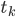

# <span class="c17 c51">Random Forest Classifier</span>

<span class="c17 c43">Eric D. Stevens</span>


# <span class="c26 c17">Overview</span>

<span class="c0">The task of building a Random Forest classification tool that can be applied to any dataset is a moderately substantial task. It first requires that the two underlying algorithms, the Decision Tree learning algorithm and Bagging algorithm, be implemented and working properly. Following these developments, a layer must be added that combines the two, creating an ensemble of decision trees based on the bags generated in the by bagging. This top layer needs to be able to query this ensemble of trees for their classification votes, and output a class prediction based on the tally (soft / hard) of these votes.</span>

<span class="c0"></span>

### <span class="c48 c17">Project Scope</span>

<span class="c0">In order to make this substantial task reasonable for the purpose of a course final project, the scope of the project had to be limited. To do this, the first stage of the project became setting straight forward goals and setting project boundaries. These are as follows:</span>

<span class="c0"></span>

<span class="c25 c17">What this project is:</span>

*   <span class="c0">From scratch implementation of a known algorithm.</span>
*   <span class="c0">Validation of work through replication of expected performance.</span>
*   <span class="c0">Mimic performance of verified tools.</span>

<span class="c25 c17">What this project is NOT:</span>

*   <span class="c0">Invent a new machine learning algorithm.</span>
*   <span class="c0">An effort to gain novel insight from some dataset.</span>
*   <span class="c0">Tuning hyperparameters to get the best performance.</span>

<span>In other words, the goal of the project is to build, from scratch (and NumPy), a Random Forest classification tool that replicates the results of verified libraries. The tuning of the algorithm to a specific dataset is irrelevant to the development of the algorithm task.</span>

### <span class="c35 c17">Project Execution Strategy</span>

<span class="c0">In order to accomplish the goals of the project in an efficient manner, a specific project execution strategy was developed prior to the beginning of the implementation itself. This strategy has both the development of the tool and its verification wrapped into a single pipeline.</span>

<div align="center">
<span style="text-align: center; overflow: hidden; align: center; display: inline-block; margin: 0.00px auto; border: 0.00px solid #000000; transform: rotate(0.00rad) translateZ(0px); -webkit-transform: rotate(0.00rad) translateZ(0px); width: 283.66px; height: 261.50px;"></span>
</div>

<span class="c0">In order to enable an efficient process that encompasses both development and verification, Scikit-Learn was leveraged for both its prepackaged datasets and its verified models. When developing the algorithm library, effort was made to replicate the data interface of Scikit-Learn. This allowed datasets to be imported from Scikit-Learn and fed to the developed implementation with minimal manipulation. This also allowed that same data to be fed into the Scikit-Learn implementation of Random Forest, after which the results of the of the two implementation could be prepared.</span>


<span>In case this is not obvious, it is important to note that</span> <span class="c31">the implementation of Random Forest executed in this project in no way leverages Scikit-Learn. Scikit-Learn is only used to validate the performance of the developed version of Random Forest.</span> <span class="c0">The only library utilized by the implementation constructed in this project is NumPy. Effort will be made in this write up to point out where, when, and why numpy is being utilized.</span>

<span class="c0"></span>

<span class="c0"></span>

# <span class="c26 c17">The Random Forest Algorithm</span>

<span class="c0">The Random Forest algorithm is an example of ensemble learning. This means that a number of “experts” (learners, or learning algorithms) are combined in a parallel manner with the assumption that their combined predictions will provide more valuable insight into the reality of the target than each one would individually. For this approach to work, the experts must each be attempting to model different characteristics of the training set.</span>

<span class="c0"></span>

<span class="c0">While some ensemble methods accomplish this by applying a variety of learning algorithms to the same training set, Random Forest does the opposite, applying the same learning algorithm (the Decision Tree) to a number of training set variants generated via another algorithm (Bagging).  The differences in the modeling of characteristics of the training set comes from the way that the Bagging algorithm modifies the dataset. A decision tree is trained on each “bag” that comes from the Bagging method. A random forest is nothing more then a set of decision trees built from “bags” that vote for a class.</span>

<span class="c0"></span>

<div align="center">
<span style="overflow: hidden; display: inline-block; margin: 0.00px 0.00px; border: 0.00px solid #000000; transform: rotate(0.00rad) translateZ(0px); -webkit-transform: rotate(0.00rad) translateZ(0px); width: 624.00px; height: 264.00px;"></span>
</div>

## <span class="c5"></span>

## <span class="c5">Decision Tree</span>

<span class="c0">The Decision Tree is the learning engine behind the random forest algorithm and is the most complex component of the Random Forest learning algorithm in terms of implementation. It works by evaluating the “purity” of a collection of data in terms of class and then partitioning across a dimension in a way that results in subsets that are more “pure”. The Decision tree learning algorithm performs this operation recursively until every datapoint is partitioned into a completely pure subset, or until some regularization criterion is met.</span>

### <span class="c35 c17">Purity</span>

<span>There are several different ways that the purity of a dataset can be measured. For the sake of brevity, only one will be discussed in this paper.</span> <span class="c31">Gini impurity</span> <span>is the purity metric that is used in the implementation later in this paper. Given some dataset</span> <span>, which contains data of</span> <span class="c0"> distinct class labels, the Gini impurity is given by</span>

<span class="c0"></span>
<div align="center">

</div>
<span class="c0"></span>

<span>Where</span> <span>is the probability of a given data point being a member of class</span> <span class="c0"> given the dataset. It can be seen that Gini impurity is minimized when all data points belong to a single class.</span>

<span style="overflow: hidden; display: inline-block; margin: 0.00px 0.00px; border: 0.00px solid #000000; transform: rotate(0.00rad) translateZ(0px); -webkit-transform: rotate(0.00rad) translateZ(0px); width: 325.50px; height: 183.54px;"></span>

<span class="c0"></span>
<div align="center">

</div>

### <span class="c35 c17">Learning</span>

<span class="c0">The Decision Tree leverages the tree data structure. Each dataset is stored in a node. Learning is performed by searching for a partition of the data that results in a minimum weighted Gini impurity. In decision trees, this partition is done by sliding a threshold across each dimension and calculating the weighted Gini impurity.</span>

<span class="c0"></span>

<span class="c0">The weighted Gini impurity is the loss function for the learning algorithm and is expressed,</span>

<span class="c0"></span>


<span>Where</span> <span>is the proportion of data points that fall below the threshold</span> <span>on the</span> <span>th dimension, and</span> <span class="c49"> </span><span>is the Gini impurity of the data that falls below the threshold</span> <span>on the</span> <span>th dimension.</span>

<span style="overflow: hidden; display: inline-block; margin: 0.00px 0.00px; border: 0.00px solid #000000; transform: rotate(0.00rad) translateZ(0px); -webkit-transform: rotate(0.00rad) translateZ(0px); width: 238.09px; height: 133.00px;"></span>

<span class="c0">After a dimension and threshold that minimizes the Gini impurity have been identified, the node of the current dataset stores these parameters and the two child nodes are created with their dataset consisting of the data on either side of the decided upon dimension threshold.</span>

<span class="c0"></span>

<span class="c0"></span>

<span style="overflow: hidden; display: inline-block; margin: 0.00px 0.00px; border: 0.00px solid #000000; transform: rotate(0.00rad) translateZ(0px); -webkit-transform: rotate(0.00rad) translateZ(0px); width: 308.50px; height: 132.52px;"></span>

<span class="c0">If a node reaches a Gini impurity of 0 it is considered a terminal node. Otherwise the decision tree will recursively repeat the process of searching for a dimension and threshold to split on, or until it is impossible to partition the data.</span>

<span class="c0"></span>

<span class="c0">This process process generates an unbalanced tree, with each node containing a splitting dimension and threshold, the Gini impurity of the node and the counts for each class in the node. Holding on to the counts of each class at each node will be important in later details of the decision tree algorithm, and therefore the Random Forest algorithm.</span>

<span class="c0"></span>

### <span class="c35 c17">Regularization</span>

<span class="c0">If the Decision Tree algorithm is allowed to run without constraint it will do its best to separate the data into 100% pure partitions. While this results in extremely high training set performance, the partitions that are made may not generalize will and will cause drastic overfitting. It is therefore necessary in most cases to use regularization when working with decision trees. There are many ways regularization can be performed with decision trees. Here only two will be discussed, the hyperparameters “max depth” and “min samples”.</span>

#### <span class="c33 c17">Max Depth</span>

<span>Setting the hyperparameter “max depth” tells the decision tree to not allow any branch of the tree to grow beyond a certain depth. In other words if a child is a “max depth” “generation” child but is still not 100% pure, it will not attempt to split and will remain as a terminal node.</span>

<span style="overflow: hidden; display: inline-block; margin: 0.00px 0.00px; border: 0.00px solid #000000; transform: rotate(0.00rad) translateZ(0px); -webkit-transform: rotate(0.00rad) translateZ(0px); width: 624.00px; height: 349.33px;"></span>

<span class="c0"></span>

<span class="c0">By limiting the depth of the tree we reduce the complexity that the model is able to achieve. Setting a max depth is setting the maximum number of partitions that can be made through any part of the original dataset.This is a hyper parameter that can be tested, tuned, and matched to the complexity of your dataset.</span>

<span class="c0"></span>

<span class="c0">The resulting tree does not have nodes that reach 100% purity. This is where the importance of keeping track of the number of samples of each class type at each node becomes important. The terminal node will ‘vote’ for the class which is most highly represented within it. Furthermore, by keeping track of the counts of the lesser represented classes, the node can return a probability for each class by dividing the number of occurrences of by the total number of samples in the node. This is common to all regularization methods, not just max depth.</span>

<span class="c0"></span>

#### <span class="c33 c17">Min Samples</span>

<span class="c0">Setting the minimum sample hyperparameter tells the tree to terminate growth if a child node contains less then a certain number of samples. This is distinctly different than the max depth regularization method, which explicitly limits the complexity that the model can achieve. The minimum samples method is about ensuring that there is ample evidence for a nodes existence by demanding that any node created represent a certain number of samples in the training set. The model can reach an arbitrary complexity if there is reason to do so.</span>

<span class="c0"></span>

<span style="overflow: hidden; display: inline-block; margin: 0.00px 0.00px; border: 0.00px solid #000000; transform: rotate(0.00rad) translateZ(0px); -webkit-transform: rotate(0.00rad) translateZ(0px); width: 624.00px; height: 340.00px;"></span>

<span class="c0">The usefulness in terms of regularization in this method is obvious. Un-regularized, the decision tree will attempt to fit to every point. If there is an outlier, a leaf node that has only one sample in it will be generated, creating a model that views that outlier as part of a larger group. Setting a min samples parameter is a way of limiting outliers ability to influence the model.</span>

<span class="c0"></span>

<span class="c0">Once again we notice that this results in terminal nodes made up of more than one class. The probability of a node representing a particular class can be interpreted as the sample count of a particular class divided by the total sample count.</span>

<span style="overflow: hidden; display: inline-block; margin: 0.00px 0.00px; border: 0.00px solid #000000; transform: rotate(0.00rad) translateZ(0px); -webkit-transform: rotate(0.00rad) translateZ(0px); width: 330.50px; height: 332.09px;"></span>

### <span class="c35 c17">Making Predictions</span>

<span class="c0">After training, class prediction becomes a very simple process. An input value is received by the head node. That head node evaluates the input its value on the split dimension and threshold and passes it on to the appropriate child. This process is repeated recursively until a leaf node is reached.</span>

<span class="c0"></span>

<span class="c0">Once a leaf node is reached the predictor can either return just the class that is most highly represented as a vote, or it can return the probability associated with the various classes at the leaf node. This is how decision trees make predictions on input data.</span>

<span class="c0"></span>

<span class="c0"></span>

## <span class="c5">Bagging</span>

<span>As mentioned earlier, for ensemble methods to function efficiently each expert must be capturing different information about the training data. One way to do this, and the way it is done by Random Forest, is by training the same learning algorithm on a number of subsets generated from the original training set. Bagging is the method that Random Forest uses to generate these subsets.</span>

### <span class="c35 c17">Bootstrapping</span>

<span class="c0">Bagging works by taking an input training set and repeatedly sampling it with replacement (bootstrapping). In the case of random forest each bag contains the same number of samples as the original training set. When performing bagging a number of “bags” is specified where a “bag” is a data dataset to be returned. In this way you are exchanging variance in the original training set for  bias in these bags. This sets up a situation where each bag is capturing different information about the original training set.</span><span style="overflow: hidden; display: inline-block; margin: 0.00px 0.00px; border: 0.00px solid #000000; transform: rotate(0.00rad) translateZ(0px); -webkit-transform: rotate(0.00rad) translateZ(0px); width: 294.50px; height: 184.53px;"></span>

<span class="c0"></span>

### <span>Feature Subsampling</span>

<span class="c0">Bagging has another aspect that diversifies the data subsets. Instead of including all of the features of the dataset in the output “bags”, it will select a random subset of features to use. Therefore, if an input dataset has n, k dimensional observations, the bags that are returned by Bagging will still have n observations, but each bag will have a different, randomly selected, subset of the dimensionality of the original dataset.</span>

#### <span class="c33 c17">Max Features</span>

<span>The user of Bagging can force high bag bias in exchange for lower variance by setting a “max features” parameter. This parameter limits the amount of features (the vector dimensionality) that the returned bags can have. So if an input dataset has k dimensional observations, each bag will have observations with at most “max features” dimensions.</span>

<span style="overflow: hidden; display: inline-block; margin: 0.00px 0.00px; border: 0.00px solid #000000; transform: rotate(0.00rad) translateZ(0px); -webkit-transform: rotate(0.00rad) translateZ(0px); width: 624.00px; height: 241.33px;"></span>

<span>By combining bootstrapping with feature subsampling, Bagging is able to generate datasets that are all capturing information about the original dataset but with highly boosted bias in exchange for less variance. In other words each of the bags is capturing very different information about the original dataset.</span>

## <span>Random Forest</span>

<span class="c0">As mentioned in the beginning of this section, the Random Forest algorithm is a simple combination of the Decision Tree learning with Bagging. The Random Forest has the same parameters as Decision Tree and Bagging combined and simply passes them along.</span>

<span class="c0"></span>

### <span class="c35 c17">Training</span><span style="overflow: hidden; display: inline-block; margin: 0.00px 0.00px; border: 0.00px solid #000000; transform: rotate(0.00rad) translateZ(0px); -webkit-transform: rotate(0.00rad) translateZ(0px); width: 303.19px; height: 387.50px;"></span>

<span class="c0">Training a Random Forest classifier is a two step process. First, a training dataset is handed to the Bagging algorithm.  Bagging returns several datasets, each of which capture different characteristics of the training set. We have been calling these generated sub-datasets bags. A decision tree is then built for each of the bags generated in the bagging step. These decision trees represent the experts for the ensemble method. The variety generated by bagging ensures that our ensemble has enough variety to effectively leverage the ensemble methodology. Each decision tree has been trained on data that has traded away much of it’s variance in exchange for boosting bias. Each tree is its own model based on the bag it was trained on.</span>

<span class="c0"></span>

<span class="c0"> </span>

### <span class="c35 c17">Making Predictions</span>

<span class="c0">What is left after training is a set of decision trees that know which features were used to train them. The random forest model feeds the input data to all the trees. Each tree extracts the relevant feature set from the data point and returns its respective prediction. The Random Forest model determines how the collection of predictions from the decision trees are interpreted. Thanks to the probabilistic nature of the decision tree, Random Forest can make predictions using a variety of methodologies. Here, hard voting and a type of soft voting will be discussed.</span>

<span class="c0"></span>

#### <span class="c33 c17">Hard Voting</span>

<span class="c0">In hard voting, each decision tree has an equally weighted vote. This results in a simple tally of the class predictions made by the decision trees.</span>

<span class="c17 c25"></span>

<span style="overflow: hidden; display: inline-block; margin: 0.00px 0.00px; border: 0.00px solid #000000; transform: rotate(0.00rad) translateZ(0px); -webkit-transform: rotate(0.00rad) translateZ(0px); width: 395.50px; height: 263.67px;"></span>

#### <span class="c33 c17">Soft Voting</span>

<span class="c0">Soft voting takes advantage of the fact that the decision trees are capable of returning the probabilities, not just class predictions. One way to do soft voting is to weight the vote of a decision tree for a given class by the probability that that tree is making that class prediction. The result is that trees that are making high probability predictions will be weighted more heavily in the random forests final class prediction.</span>

<span class="c0"></span>

<span style="overflow: hidden; display: inline-block; margin: 0.00px 0.00px; border: 0.00px solid #000000; transform: rotate(0.00rad) translateZ(0px); -webkit-transform: rotate(0.00rad) translateZ(0px); width: 418.02px; height: 258.50px;"></span>

<span class="c0"></span>

# <span>Python Implementation of Random Forest</span>

<span class="c0">This section describes the code library that accompanies this report. Details of the operation of the nature of the Random Forest classifier will be skipped over in this section as they are thoroughly described in the preceding section, which the implementation follows exactly. The code includes an implementation of Random Forest that utilizes only the NumPy library for matrix operations and features like sorting, finding max or min, etcetera. Also included are verification scripts that pit the developed library up against SciKit-Learn’s own implementation of the Random Forest classifier. This section will describe the code library and the code itself.</span>

<span class="c0"></span>

## <span>File Structure</span>

<span style="overflow: hidden; display: inline-block; margin: 0.00px 0.00px; border: 0.00px solid #000000; transform: rotate(0.00rad) translateZ(0px); -webkit-transform: rotate(0.00rad) translateZ(0px); width: 594.50px; height: 283.61px;"></span>

<span class="c0"></span>

### <span class="c35 c17">Implementation files</span>

<span class="c0">The implementation files are in the “tree”, “bagging”, and “forest” directories in which Decision Tree, Bagging, and Random Forest are implemented respectively. Nowhere in these files will you see any calls to machine learning libraries. They are written with only the aid of NumPy. If a user wants to use the random forest classifier implemented here they would only need access to the “forest” directory.</span>

### <span>Validation Scripts</span><span class="c35 c17"> </span>

<span class="c0">As mentioned in the Project Execution Strategy section of the introduction, SciKit-Learn datasets and algorithm libraries are utilized in the validation of the library implemented for this project.</span>

<span class="c0"></span>

<span class="c0">In the “validation” directory there are two sub directories: “my_validations” and “sklearn_validations”. In “my_validations”, there are three files, each corresponding to a SciKit-Learn classification dataset. These are scripts that run the project implementation of Random Forest on the corresponding datasets. In the “sklearn_validations” are three files that run SciKit-Learn’s implementation of Random Forest on the same datasets.</span>

<span class="c0"></span>

<span>The scripts have been written to have very similar output formatting, making it easy for a user to compare the performance of the two implementations. Effort was also taken to make it easy to adjust model hyperparameters and things like test-train split ratios while maintaining model characteristic similarity.</span>

<span class="c0"></span>

## <span class="c5">Decision Tree Implementation</span>

<span class="c0"> The Decision Tree implementation is contained within the “tree” directory of the project. In this directory there are two main files, “tree.py” and “node.py”. The “tree.py” file is the user interface for the Decision Tree model. It contains the “Tree” class which can instantiate a Decision Tree model object, train the model on a dataset, and make predictions on new data points. The “node.py” file is the learning engine for Decision Tree. In it, a class called “Node” is responsible for training the tree. This is the most complex file in the project.</span>

<span class="c0"></span>

### <span class="c35 c17">The tree.py file and Tree class</span>

<span class="c0">The “tree.py” file contains the “Tree” class. This class is the interface to the Decision Tree learning algorithm.</span>

<span class="c0"></span>

#### <span class="c33 c17">Tree class initialization</span>

<span class="c0"></span>

<a id="t.2ef886ea0b05000ff51c5e81ca2cee91171542d6"></a><a id="t.0"></a>


```python
      def __init__(self,  
               max_depth: int = 10,  
               min_node_points = 1):
      """  
      Instantiates the decision tree model object  
      :param max_depth: maximum depth decision tree can grow  
      :param min_node_points: minimum points a leaf node can contain  
      """
```


<span class="c0"></span>

<span class="c0">The tree class is initialized with the hyperparameters for the Decision tree learning algorithm. These parameters are stored as member variables and used for training. Notice that the class is instantiated without training data. Training data is fed into the model when a call to the training method is made.</span>

<span class="c0"></span>

#### <span>Tree.train() : Training the Decision Tree</span>

```python
    def train(self, x: np.ndarray, y: np.ndarray):
        """
        Train the Decision Tree on input data
        :param x: Matrix with rows as observations and
            columns as features.
        :param y: A single column matrix with the same number
            of rows as the input parameter x
        """
        assert(x.shape[0] == y.shape[0])
        assert(y.shape[1] == 1)

        self.head = Node(data=x,
                         labels=y,
                         max_depth=self.max_depth,
                         min_node_points=self.min_node_points)

        self.trained = True
```

<span>After a</span> <span class="c15">Tree</span> <span>object is initialized, the</span><span class="c15"> train()</span><span>method can be called on an input dataset. The asserts insure that the data is formatted properly which is tricky. The targets,</span> <span class="c15">y</span><span>must be a single column. A member variable</span> <span class="c15">self.head</span><span>is set to</span> <span class="c15">Node()</span><span>.</span> <span class="c15">Node()</span><span class="c0"> is the training engine that builds the tree model. This will be discussed later in this section.</span>

<span class="c0"></span>

#### <span class="c33 c17">Tree.predict() : making class predictions on a data point</span>

```python
    def get_prediction(self, node, x: np.ndarray):
        if not node.right_child or not node.left_child:
            class_precition = max(node.class_count_dict,
                                  key=node.class_count_dict.get)
            percent = node.class_count_dict[class_precition]/node.n
            return class_precition, percent
        else:
            if x[node.split_dim] < node.split_threshold:
                return self.get_prediction(node.left_child, x)
            elif x[node.split_dim] >= node.split_threshold:
                return self.get_prediction(node.right_child, x)
```

<span class="c0"></span>

<span>Predictions are made by descending down a tree until a leaf node is reached and then returning the prediction of the leaf node. In the code we see that the line</span> <span class="c40 c31">if</span><span class="c15"> </span><span class="c40 c31">not</span><span class="c15">node.right_child</span> <span class="c40 c31">or</span><span class="c15"> </span><span class="c40 c31">not</span><span class="c15"> node.left_child</span><span>is the first check this is made. If this statement is triggered it means that a leaf node has been reached. Since a leaf node has been reached</span> <span class="c15">max(node.class_count_dict,key=node.class_count_dict.get)</span><span>  get the class with the highest representation in the node as well as its count. This is converted into a percentage of total points in the leaf node and then returned as a</span><span class="c15"> class_precition, percent</span><span class="c0"> tuple.</span>

<span class="c0"></span>

<span>If the current node is not a leaf node, then the prediction function compares the input data on the node dimension and threshold and determines whether it should proceed to the right or the left child.</span> <span class="c31 c40">if</span><span class="c15"> x[node.split_dim] < node.split_threshold</span><span class="c0">, then we  know that we should next look at the left child. The predict function is then called recursively on the current nodes child. This process continues continues until a leaf node is reached and the process in the preceding can take place.</span>

<span class="c0"></span>

### <span class="c35 c17">The node.py file and Node() Class</span>

<span>When discussing the training method in the tree class we skipped over a lot. In the Tree class, a member variable, self.head, was simply set to a class called Node() and nothing more was done.</span> <span class="c15">Node</span> <span class="c0">is a class that upon initialization builds the entire Decision Tree model. This is the most complex portion of the project and so it will be covered in detail here.</span>

<span class="c0"></span>

<span>First, a discussion of what is happening in the initialization. This discussion will include what is occuring, but not how. There are several member functions of the</span> <span class="c15">Node</span> <span>class, and it will be easier to explain first and then cover their operation after. We start with a run through of the initialization.</span>

#### <span class="c33 c17">Node class initialization</span>

<span class="c0"></span>


```python
class Node:

    def __init__(self,
                 data: np.ndarray,
                 labels: np.ndarray,
                 impurity_metric: str = 'gini',
                 depth: int = 0,
                 max_depth: int = 10,
                 min_node_points = 1):
```


<span class="c0">The node class is initialized with the variable data which is the training data without the labels and labels, which are the class labels. The impurity metric is there for later if other impurity metrics are added. The depth parameter is the current depth of the node in the tree. This is used to allow children nodes how deep they are. The max_depth is the max depth hyperparameter discussed earlier and the min_node_points is the min samples hyperparameter discussed earlier.</span>

```python
         # class breakdown
        self.class_labels, self.class_counts = \
            np.unique(self.labels, return_counts=True)
```

<span class="c0">The call to np.unique returns the unique class labels contained in the datasets as well as their counts as a tuple. This is converted to a dictionary as follows:</span>

<a id="t.f21512e3dc14ae163de5cc8d369d3f9c74751378"></a><a id="t.5"></a>

```python
self.class_count_dict = {l:c for l,c in zip(self.class_labels, self.class_counts)}
```

<span class="c0">From there the with the highest representation and its percentage of representation are recorded.</span>

```python
# used for predict
self.best_label = max(self.class_count_dict, key=self.class_count_dict.get)
self.best_percent = self.class_count_dict[self.best_label]/                       sum(self.class_counts)
```

<span class="c0">The node impurity is then calculated with a call the Gini impurity calculation function.</span>

```python
def calc_gini(self) -> float:
   return 1. - np.sum(np.square(self.class_counts/self.n))
```

<span class="c0">If the impurity of the node is determined to be 0 then a return call is made without declaring any children. If the Gini impurity is not zero then we move on to the following code.</span>

```python
# if a node is not at the max depth, spawn children
if self.depth < self.max_depth:
    self.split_dim, self.split_threshold, self.gain = self.spawn_children()
```

<span class="c0">There is a check to see if the current node is at max depth. If it is then the next line is skipped over and the function returns. If the current node is not at max depth then the spawn_children() function is entered, to return a splitting dimension and threshold.</span>

<span class="c0"></span>

#### <span class="c33 c17">Node.spawn_children()</span>

<span class="c0">This function, and its helper functions, do the heavy lifting of the decision tree learning algorithm. First a call is made to the member function 'self.find_split()" which returns the dimension and the threshold on that dimension that partitions the data in a way that results in the smallest Gini impurity.</span>

```python
        split_dimension, split_threshold, split_cost = self.find_split()
        if split_threshold == None:
            return None,None,None
        self.split_threshold = split_threshold
        self.split_dim = split_dimension
```

<span class="c0">The return value split_cost is the best impurity value found. If no splitting threshold can be found all None values are returned, signaling the decision tree to use the calling parent as the leaf node. This can be triggered by things like there not being enough samples to find a threshold based on the min samples hyperparameter. If a good split is found then the data is partitioned into less than and greater than threshold sets.</span>

```python
        # Parse data based on above calculated split criterion
        # [X,y] -> [X_l,y_l],[X_r,y_r]
        left_indices = np.argwhere(self.data[:, split_dimension] <= split_threshold)
        left_data = self.data[left_indices[:, 0], :]
        left_labels = self.labels[left_indices[:, 0], 0]
        left_labels = np.atleast_2d(left_labels).T
        right_indices = np.argwhere(self.data[:, split_dimension] > split_threshold)
        right_data = self.data[right_indices[:, 0], :]
        right_labels = self.labels[right_indices[:,0], 0]
        right_labels = np.atleast_2d(right_labels).T
```

<span class="c0">This is where Numpy is leveraged heavily. Numpy allows us to quickly partition the data and labels by grabbing indices instead of values where conditions are met. The row indices of observations that meet the threshold criteria are captured and then the data points are collected at the same time as the labels using the indices.</span>

<span class="c0"></span>

<span class="c0">Now that the data has been partitioned in either side of the threshold the recursive call to spawn children can be made.</span>

```python
        if self.n > self.min_node_points:

            # spawn left child
            if left_data.shape[0] > 0:
                self.left_child = Node(data=left_data,
                                       labels=left_labels,
                                       impurity_metric=self.impurity_metric,
                                       depth=self.depth + 1,
                                       max_depth=self.max_depth,
                                       min_node_points=self.min_node_points)
            # spawn right child
            if right_data.shape[0] > 0:
                self.right_child = Node(data=right_data,
                                        labels=right_labels,
                                        impurity_metric=self.impurity_metric,
                                        depth=self.depth + 1,
                                        max_depth=self.max_depth,
                                        min_node_points=self.min_node_points)

        return split_dimension, split_threshold, split_cost
```
        
<span class="c0">The return value here is to set the current node what the splitting dimension and threshold are that these children are beings spawned based off of. They will be used in prediction time to cascade down the tree.</span>

<span class="c0"></span>

#### <span class="c33 c17">Node.find_split()</span>

<span class="c0">Once again, a deeper dive is needed to understand the operation of the previous section. In the spawn_children function the call was made to find_split() here we will discuss how this function works.</span>

<span class="c0"></span>

<span>There is an</span> <span class="c31">extremely important</span><span class="c0"> concept that must be discussed here before proceeding which is key to a practical implementation of decision tree. If we attempt to brute force search for the best splitting threshold across all dimensions we will have algorithmic time complexity</span>

<span>where</span> <span>is the dimensionality of the data and</span> <span>is the number of observations in the training set. This is because we need to compare the Gini impurity at each point relative to all the other points in the dataset. However if we sort the data by dimension, an operation with a time complexity of</span> <span>) then we can simply make a linear sweep across each dimension. This results in an overall time complexity of</span> <span class="c0">).</span>

<span class="c0"></span>

<span class="c0">The following line of code leverages NumPy to return a matrix of indices sorted by value in each dimension.</span>

```python
        # get array of the size of the data but with values
        # corresponding to sorted indices by column.
        sorted_indices = np.argsort(self.data, axis=0)
```

<span class="c0">Now we loop through each dimension searching for its best threshold and store the best one.</span>

```python
        # for each column of sorted indices get best split
        for dim in range(sorted_indices.shape[1]):
            dim_indices = np.atleast_2d(sorted_indices[:, dim]).T
            cur_impur, cur_thresh = self.single_dim_split(dim, dim_indices)
            if cur_impur < best_impurity:
                best_impurity = cur_impur
                best_dimension = dim
                best_threshold = cur_thresh

        return best_dimension, best_threshold, best_impurity
```

<span class="c0">We see the call to self.single_dim_split() which is the final piece to the puzzle and will be discussed next.</span>

<span class="c0"></span>

#### <span class="c33 c17">Node.single_dim_split()</span>

<span class="c0">The inputs to this function are the current dimension that is being analyzed and the list of indices that correspond to the data in that dimension sorted by value. First we initialize the label counts  the split so that all the count for less then the threshold is 0 and all counts are on the greater than side.</span>

```python
        # get the labels as a dict
        left_label_counts = {l:0 for l in self.class_labels}
        right_label_counts = {l:c for l,c in zip(self.class_labels, self.class_counts)}
```

<span class="c0">We then define an in function function for the calculation of the weighted Gini impurity value.</span>

```python
        def mini_gini(left_dict, right_dict):
            left_values = np.array(list(left_dict.values()))
            g_left = 1. - np.sum(np.square(left_values/np.sum(left_values)))
            right_values = np.array(list(right_dict.values()))
            g_right = 1. - np.sum(np.square(right_values/sum(right_values)))
            total = sum(left_values) + sum(right_values)
            return (sum(left_values)/total)*g_left + (sum(right_values)/total)*g_right
```

<span class="c0">Then, we iterate through the sorted values incrementing the count of the label we pass in the less then counts and decrementing it in the greater than counts. The weighted Gini impurity is recalculated and stored if it beats the previous best.</span>

```python
        # iterate through each sorted index updating split membership
        for i in range(1, self.n):
            left_val = self.data[indices[i-1, 0], dim]
            right_val = self.data[indices[i, 0], dim]
            left_label_counts[self.labels[indices[i-1, 0], 0]] += 1
            right_label_counts[self.labels[indices[i-1, 0], 0]] -= 1
            cost = mini_gini(left_label_counts, right_label_counts)

            # if split results in better purity, keep it
            if cost < best_impurity and \
                    self.min_node_points < i < self.n - self.min_node_points:
                best_impurity = cost
                best_threshold = (left_val+right_val)/2

        return best_impurity, best_threshold
```


## <span class="c5">Bagging</span>

<span>The</span> <span class="c15">bagging</span> <span class="c0">script is fairly straight forward. It is a class the leverages NumPy to accomplish a few goals. There is a subclass called _Bag that holds the individual bags that are created. The Bagging class is a container for these _Bag objects.</span>

<span class="c0"></span>

#### <span>Bagging class initialization</span>

```python
class Bagging:

    def __init__(self,
                 data: np.ndarray,
                 labels: np.ndarray,
                 n_bags: int,
                 max_features: int):
```

<span class="c0">The Bagging class initialization has the same data interface as the Tree.train() method. The hyperparameters are n_bags and max_features which were discussed earlier. The user need nothing more than the data and these parameters to create the Bagging object.</span>

<span class="c0"></span>

<span class="c0">All subsampling and bag generation is done upon initialization of the object. This is done with a list comprehension that generates _Bag class objects which has to be handed num_features, the number of features that the original dataset has.</span>

```python
        # list comprehension of _Bag class objects
        self.bag_list = [_Bag(data_size=self.n,
                              num_features=self.num_features,
                              max_features=self.max_features)
                         for _ in range(self.n_bags)]
```

#### <span class="c33 c17">The _Bag subclass</span>

<span class="c0">The bag subclass handles the work of bagging using NumPy’s random number generators and some handy sampling tools. It is all taken care of in initialization of the _Bag class. What follows is the entirety of the _Bag class.</span>

<span class="c0"></span>


```python
class _Bag:

    def __init__(self,
                 data_size: int,
                 num_features: int,
                 max_features: int,
                 bootstrap_features: bool):

        # determine how many features will be used
        self.n_features = np.random.randint(low=1, high=max_features+1)

        # get the features
        self.features = np.random.choice(range(num_features),
                                         size=self.n_features,
                                         replace=False)

        # sample index range randomly
        self.indices = np.random.choice(range(data_size),
                                        size=data_size,
                                        replace=True)
```

<span>The NumPy randint call determines how many features will be used in a range from 1 feature to max_features features. The NumPy choice selects the subset of features that will be used in the bag. Finally the member</span> <span class="c15">indices</span> <span class="c0">is set to be to be bootstrapped indices of the observations in the original dataset. Since all that the bag object is holding is a set of row indices and column indices the Bagging class needs to have a helper function that converts that information back into data.</span>

<span class="c0"></span>

#### <span class="c33 c17">Bagging.get_bag()</span>

<span class="c0">When the bagging class is initialized a number of bags to create is specified with the n_bags parameter. This creates a list of n _Bag objects that contains bootstrapped observation indices as well as feature subset indices. The get_bag() method is responsible for converting that information back into actual data.</span>

<span class="c0"></span>

```python
    def get_bag(self, bag_index: int):
        assert(bag_index < len(self.bag_list))
        bag = self.bag_list[bag_index]

        rows = np.atleast_2d(bag.indices).T
        bag_data = self.data[rows, bag.features]
        bag_labels = self.labels[bag.indices]

        return bag_data, bag_labels, bag.features
```

<span class="c0"></span>

<span class="c0">The get_bag() method extracts data from the original dataset in the format specified by the _Bag object. What is returned is the bag dataset, the labels that correspond to that dataset, and the features indices with respect to the original dataset that the returned dataset contains.</span>

<span class="c0"></span>

## <span class="c5">Random Forest</span>

<span class="c0">Now the two algorithms, Decision Tree and Bagging, must be combined into a coherent ensemble. Gluing the two together does take some special consideration that will be discussed in this section.</span>

<span class="c0"></span>

#### <span class="c33 c17">Forest class initialization</span>

<span>The Forest class is the Random Forest model object in this implementation. It takes all the parameters of both the</span><span class="c15"> Node()</span><span>class and the</span> <span class="c15">Bagging()</span><span> class as well as the input data.</span>

```python
class Forest:

   def __init__(self,

                # input
                data: np.ndarray,
                labels: np.ndarray,

                # bagging features
                n_trees: int,
                max_features: int,
                bootstrap_features: bool,

                # decision tree features
                max_depth: int,
                min_leaf_points: int,):
```       
                
<span class="c0">A special subclass is created called _TreeBag which holds a decision tree that was created from one of the bags. This is needed because otherwise there is no way of connecting the subset of features that were created in the bagging operation with the original dataset. In this subclass is where the decision trees are trained.</span>

```python
class _TreeBag:

    def __init__(self,
                 features: np.ndarray,
                 data: np.ndarray,
                 labels: np.ndarray,
                 max_depth: int,
                 min_leaf_points: int):

        self.features = features

        self.d_tree = Tree(max_depth=max_depth,
                           min_node_points=min_leaf_points)
        self.d_tree.train(data, labels)

    def predict(self, x):
        x_bag = x[self.features]
        return self.d_tree.predict(x_bag)
```

<span class="c0">Now, back in the Forest initialization we use a for loop to create a list of _TreeBag objects, accessing each of the bags in the Bagging object that was created earlier in the initialization.</span>

```python
        # plant a forest
        self.tree_bag = []
        for i in range(len(self.bag.bag_list)):
            print("Training Tree {} / {}".format(i, self.n_trees))
            b_data, b_labels, b_features = self.bag.get_bag(i)
            self.tree_bag.append(_TreeBag(features=b_features,
                                          data=b_data,
                                          labels=b_labels,
                                          max_depth=self.max_depth,
                                          min_leaf_points=self.min_leaf_points))
```

<span class="c0">Now we have a fully trained Random Forest classifier.</span>

<span class="c0"></span>

<span class="c0"></span>

#### <span>Forest.predict()</span>

<span class="c0"></span>

<span class="c0">The Forest class has a predict() function that takes an input data point and a voting style, soft or hard.</span>

```python
    def predict(self,
                x: np.ndarray,
                vote: str = 'soft'):

        polls = [t.predict(x) for t in self.tree_bag]
        tally = Counter()
        for cls, scr in polls:
            total = 0
            if vote=='soft':
                tally[cls] += scr
                total+= scr
            elif vote=='hard':
                tally[cls] += 1
                total += 1

        predicted_class = max(tally, key=tally.get)
        probability = tally[predicted_class]/total

        return predicted_class, probability
```

<span class="c0">If a hard vote style is selected each tree is given a +1 vote. If soft voting is used, each trees vote is ‘scr’, the probability that that it predicts that class with.</span>

<span class="c0"></span>

# <span class="c17 c26">Results</span>

<span class="c0">As discussed in the beginning of this paper, the goal of this project was to mimic the performance of SciKit-Learn’s tools, using SciKit-Learn data. We have three datasets. The information being used is not important to the effort in this project but for those who are curious, the nature of the datasets can be found in the following links:</span>

<span class="c0"></span>

<span class="c25 c17">Iris plants dataset</span>

<span class="c38">[https://scikit-learn.org/stable/datasets/index.html#iris-plants-dataset](https://www.google.com/url?q=https://scikit-learn.org/stable/datasets/index.html%23iris-plants-dataset&sa=D&ust=1578488129456000)</span>

<span class="c25 c17"></span>

<span class="c25 c17">Breast cancer diagnostic dataset</span>

<span class="c38">[https://scikit-learn.org/stable/datasets/index.html#breast-cancer-wisconsin-diagnostic-dataset](https://www.google.com/url?q=https://scikit-learn.org/stable/datasets/index.html%23breast-cancer-wisconsin-diagnostic-dataset&sa=D&ust=1578488129457000)</span>

<span class="c0"></span>

<span class="c31">MNIST optical character recognition dataset</span><span> </span><span class="c38">[https://scikit-learn.org/stable/datasets/index.html#optical-recognition-of-handwritten-digits-dataset](https://www.google.com/url?q=https://scikit-learn.org/stable/datasets/index.html%23optical-recognition-of-handwritten-digits-dataset&sa=D&ust=1578488129458000)</span>

<span class="c0"></span>

<span class="c0"></span>

## <span class="c5">Iris plants dataset results</span>

### <span class="c35 c17">trees=30, max_depth=4, min_leaf_samples=3, max_features=2</span>

<span style="overflow: hidden; display: inline-block; margin: 0.00px 0.00px; border: 0.00px solid #000000; transform: rotate(0.00rad) translateZ(0px); -webkit-transform: rotate(0.00rad) translateZ(0px); width: 417.21px; height: 188.50px;"></span>

<span class="c0"></span>

### <span class="c17 c35">trees=30, max_depth=4, min_leaf_samples=3, max_features=2</span>

<span style="overflow: hidden; display: inline-block; margin: 0.00px 0.00px; border: 0.00px solid #000000; transform: rotate(0.00rad) translateZ(0px); -webkit-transform: rotate(0.00rad) translateZ(0px); width: 424.70px; height: 198.50px;"></span>

## <span class="c5">Breast cancer diagnostic dataset results</span>

### <span class="c35 c17">trees=100, max_depth=8, min_leaf_samples=5, max_features=20</span>

### <span class="c35 c17"></span>

<span style="overflow: hidden; display: inline-block; margin: 0.00px 0.00px; border: 0.00px solid #000000; transform: rotate(0.00rad) translateZ(0px); -webkit-transform: rotate(0.00rad) translateZ(0px); width: 428.40px; height: 178.50px;"></span>

<span class="c0"></span>

<span class="c0"></span>

## <span class="c5">MNIST dataset results</span>

### <span>trees=100, max_depth=15, min_leaf_samples=8, max_features=30</span>

<span class="c0"></span>

<span style="overflow: hidden; display: inline-block; margin: 0.00px 0.00px; border: 0.00px solid #000000; transform: rotate(0.00rad) translateZ(0px); -webkit-transform: rotate(0.00rad) translateZ(0px); width: 528.44px; height: 356.50px;"></span>

### <span class="c35 c17">trees=100, max_depth=15, min_leaf_samples=8, max_features=3</span>

<span style="overflow: hidden; display: inline-block; margin: 0.00px 0.00px; border: 0.00px solid #000000; transform: rotate(0.00rad) translateZ(0px); -webkit-transform: rotate(0.00rad) translateZ(0px); width: 624.00px; height: 412.00px;"></span>

### <span class="c35 c17">trees=10, max_depth=15, min_leaf_samples=8, max_features=30</span>

<span style="overflow: hidden; display: inline-block; margin: 0.00px 0.00px; border: 0.00px solid #000000; transform: rotate(0.00rad) translateZ(0px); -webkit-transform: rotate(0.00rad) translateZ(0px); width: 624.00px; height: 424.00px;"></span>

<span class="c0">We can see that for the most part the results are comparable with the performance of SciKit-Learn with slightly lower performance. There is a drastic drop in performance in the second test of the MNIST dataset and I am not sure why.  </span>

<span class="c0"></span>

<span class="c0"></span>

<span class="c0"></span>

<span class="c0"></span>

<span class="c0"></span>

<span class="c0"></span>

<span class="c0"></span>

<span class="c0"></span>

<span class="c0"></span>

<span class="c0"></span>

<span class="c0"></span>

<span class="c0"></span>

<span class="c0"></span>

<span class="c0"></span>

<span class="c0"></span>

# <span class="c26 c17">Notes On Running the Code</span>

## <span class="c5">PYTHONPATH</span>

<span class="c0">For this project to run properly it is critical that the main directory be on the python path. This can be accomplished by adding it to the environments site packages or by adding it to they PYTHONPATH system variable. This is because the internal scripts access each other by assuming that the main directory is a library on the PYTHONPATH. They are absolute imports.</span>

<span class="c0"></span>

<span class="c0">If you don’t know how to add a directory to the python path here are some resources:</span>

<span class="c0"></span>

<span class="c25 c17">Windows:</span>

<span class="c38">[https://www.youtube.com/watch?v=A7E18apPQJs](https://www.google.com/url?q=https://www.youtube.com/watch?v%3DA7E18apPQJs&sa=D&ust=1578488129467000)</span>

<span class="c0"></span>

<span class="c31">Mac:</span> <span class="c0">On a Mac this can be accomplished by going to the terminal and entering:</span>

<a id="t.e668fd0178423b6a3e68bb4ba777c1738598b3d1"></a><a id="t.25"></a>

<table class="c7">

<tbody>

<tr class="c22">

<td class="c2" colspan="1" rowspan="1">

<span class="c15 c50">export PYTHONPATH=</span><span class="c50 c52">"/Users/my_user/directory_to_this_project"</span>

</td>

</tr>

</tbody>

</table>

<span class="c0"></span>

# <span class="c26 c17">Conclusion</span>

<span class="c0">Overall I am happy with the way this project turned out. The performance of my classifier was great knowing that my competition was a seasoned machine learning tool. Electing Random Forest as my project subject gave me the opportunity to learn more about several different methodologies in machine learning.</span>

<span class="c0"></span>

<span class="c0"></span>
